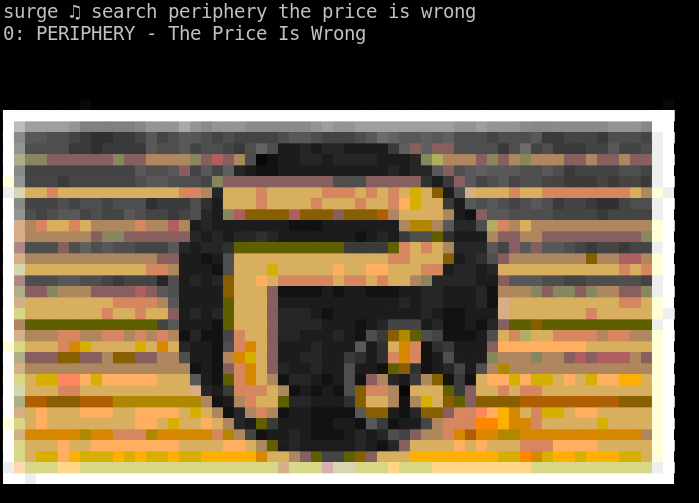

# surge

Command-line YouTube-based music player. Dependencies:

```
* rust-nightly
* youtube-dl
* libmpv
* A valid YouTube api key
* A terminal which supports truecolor
```

### First time setup

```
<surge setup> Enter value for yt_api_key: ***
First time setup complete!

surge ♫
```

`surge` uses the local subcrate [app_setup](./app_setup) to perform a first-time configuration, and write the results to `~/.config/surge/surge.ini`.

`app_setup` is not ready to be released yet on crates.io but feel free to use it.


### Play music



* `search` populates a `Vec` of 5 current results
* `cycle` cycles through
* `play <selection>` plays the selection immediately
* `queue <selection>` queues the selection
* `related` populates the `Vec` with 5 related videos
* `pause/play` pauses and resumes
* `stop` stops the player and clears the queue
* `loop` toggles loop mode
* `download` toggles download mode (to download the audio file instead of streaming straight to `libmpv`)

### Readline

Surge uses `rustyline` which is a pure-Rust implementation of GNU Readline. It supports command history and other readline goodies:

* Emacs navigation keys
* Ctrl-R for reverse search
* Up/down arrows to cycle through commands

